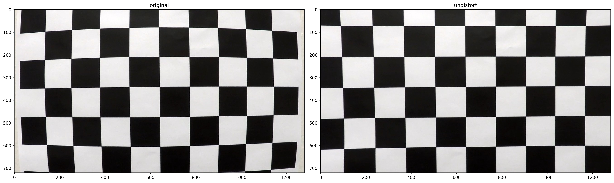
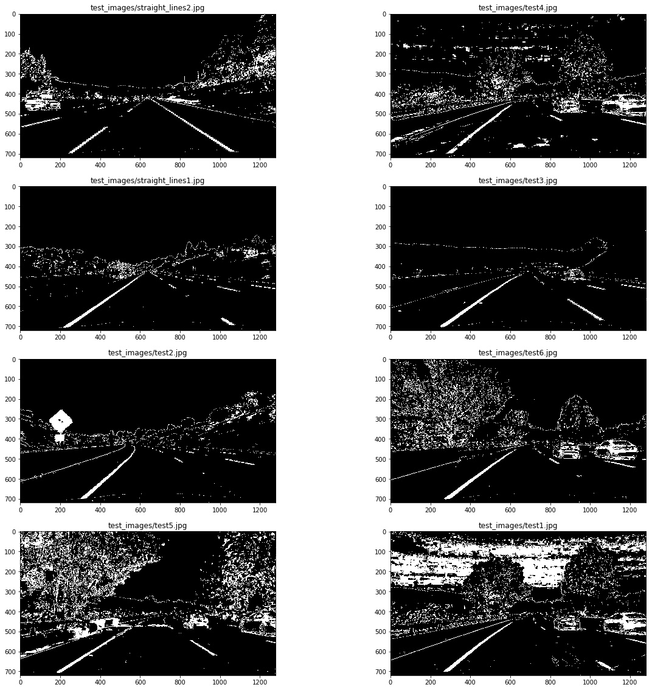
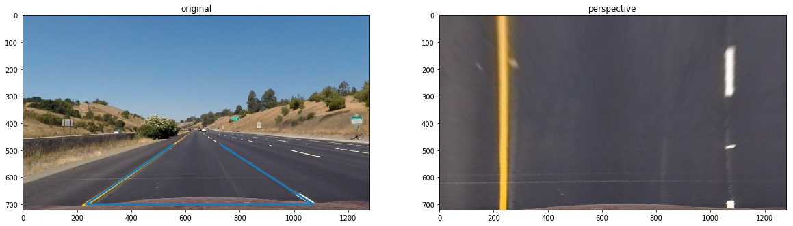
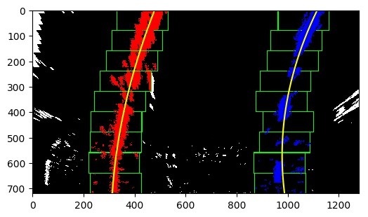
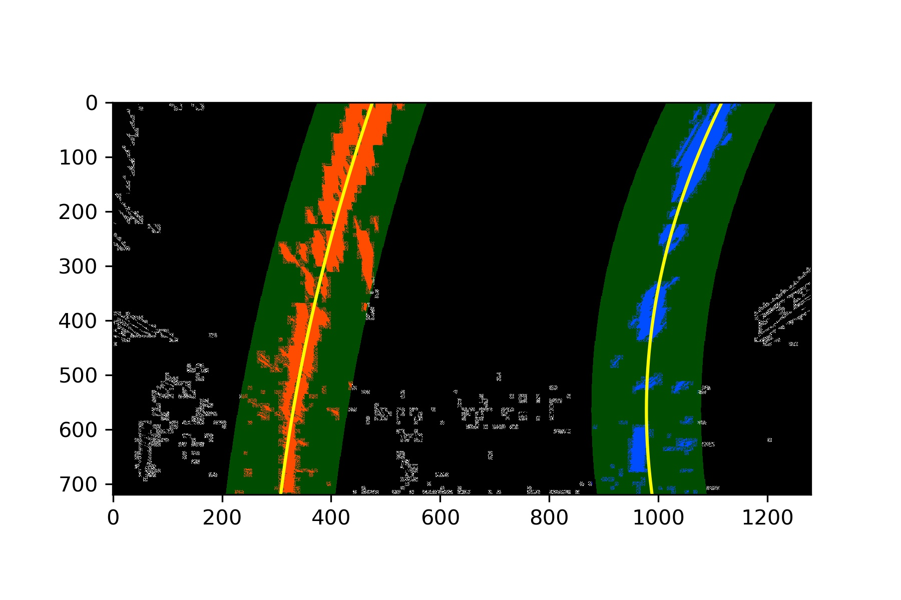
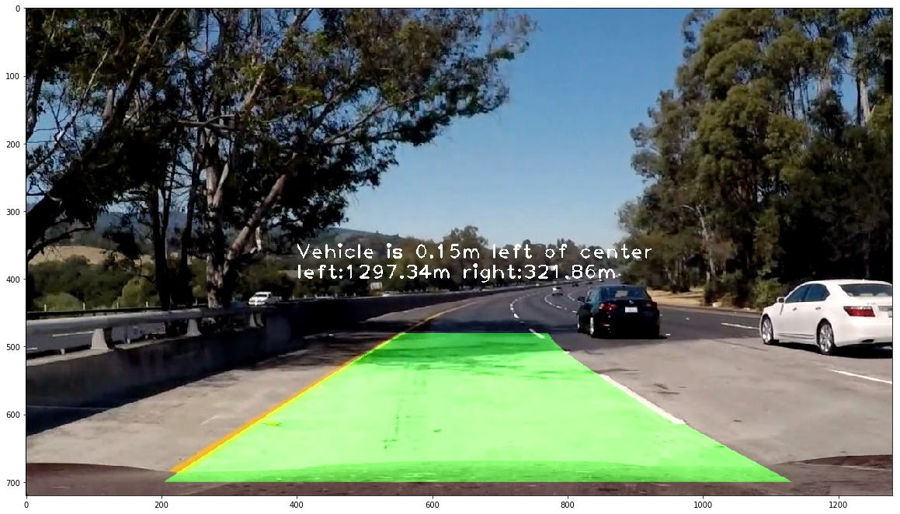

# Advanced Lane Finding Project

The goals / steps of this project are the following:

- Compute the camera calibration matrix and distortion coefficients given a set of chessboard images.
- Apply a distortion correction to raw images.
- Use color transforms, gradients, etc., to create a thresholded binary image.
- Apply a perspective transform to rectify binary image ("birds-eye view").
- Detect lane pixels and fit to find the lane boundary.
- Determine the curvature of the lane and vehicle position with respect to center.
- Warp the detected lane boundaries back onto the original image.
- Output visual display of the lane boundaries and numerical estimation of lane curvature and vehicle position.

# Camera Calibration

The code of this part is located in the **preprocessing.ipynb**.

I start by preparing "object points", which will be the (x, y, z) coordinates of the chessboard corners in the world. Here I am assuming the chessboard is fixed on the (x, y) plane at z=0, such that the object points are the same for each calibration image. Thus, objp is just a replicated array of coordinates, and objpoints will be appended with a copy of it every time I successfully detect all chessboard corners in a test image. imgpoints will be appended with the (x, y) pixel position of each of the corners in the image plane with each successful chessboard detection.

I then used the output objpoints and imgpoints to compute the camera calibration and distortion coefficients using the cv2.calibrateCamera() function. I applied this distortion correction to the test image using the cv2.undistort() function and obtained this result:


# Pipeline (single images)
1. To demonstrate this step, I will describe how I apply the distortion correction to one of the test images like this one:


I used a combination of color and gradient thresholds to generate a binary image (thresholding steps at lines in **threshold.py**. Here's and example of my output for this step.


The combination contains sobelx, magnitude of gradient, the Red channel and S channel. The combination can be find in **threshold.py** and the parameters are also wrritten in it.

The mainly parameters are

name | value
---|---
ksize | 3
x sobel | (10, 100)
magnitude gradient | (50, 200)
direction gradient | (1.2, 1.9)
S channel | (125, 255)
R channel | (200, 255)


The code for my perspective transform includes a function called **cv2.warpPerspective**, which appears in the file **preprocessing.ipynb**(the last cell). The function takes as inputs an undistorted image, as well as source and destination points. I chose the hardcode the source and destination points in the following manner:

```python
firstline = 480
secondline = 700
x1 = 554
x2 = 233
x3 = 1070
x4 = 732

first_point = (x1, firstline)
second_point = (x2, secondline)
third_point = (x3, secondline)
fourth_point = (x4, firstline)
src = np.float32([first_point, second_point, third_point, fourth_point])
dst = np.float32([(x2, 0), (x2, 720), (x3, 720), (x3, 0)])
```
This resulted in the following source and destination points:


Source | Destination
--- | ---
554, 480 | 233, 0
233, 700 | 233, 720
1070, 700 | 1070, 720
732, 480 | 1070, 0
    

In order to make the pipeline more robust, I use the combination like this, any two pairs 
```python
combined[((S_binary == 1) & (sobel_binary == 1)) | ((S_binary == 1) &  (R_binary == 1)) | ((sobel_binary == 1) & (R_binary == 1))]
```                                                    
I verified that my perspective transform was working as expected by drawing the src and dst points onto a test iamge and its warped counterpart to verify that the lines appear parallel in the warped image.


Then I did some other stuff and fit my lane lines with a 2nd order polynomial kinda like this:



The Code is located in **sliding_window.py**, in the function find_lane_pixels. With the first frame I used the method of sliding window.
Sliding window will use the histogram of the gray image to find out the starting point of the lane.
After finding the starting point, it begain to search along the first window, and then calculate the histogram of the pixel value again to find out next center point of the window.
The loop will continue until it exceeds the image.
After the first frame, I use the another sliding window method, the code is mainly located in **prev_ploy.py**. Because the first sliding window has come up with the coefficients of polynominals. We can decrease the searching space to the area near polynomial line.
The result looks like this.


Thus we get the polynomial for every picture, we can calculate the curvature and also the distance for every picture.
The curvative I calculated use the equation below.
$$R_{curve} = \frac{[1+(\frac{dx}{dy})^2]^{3/2}}{\frac{d^2x}{dy^2}}$$

And then transform to the real world unit of meters.
The distance is calculate by (center of the road - center of the image).
And it is calculate as the presude code below
```python
distance = (1280/2 - (leftx + rightx) / 2) * xm_per_pix
```
The codes are both located in **radius_curve.py**(line 25-54). 

This is the example image of the result. The code is in **pipeline.ipynb**.



# Pipeline (video)
The vedio is located in *project_test.mp4*.[video link](https://github.com/Bovey0809/CarND-Advanced-Lane-Lines/blob/master/project_test.mp4)

I have tried both the convolution and sliding window methods to track the lane. And I found the convolution ones can't find the Dotted line in the threshold images. It is because of the layer, when the window height is not tall enough, the area may be totally black, so that the convolution operation could not find out the 'potential point'. But when we use the sliding window, it has a pre-sense of the lane by using polynomial, which is the mainly reason for me to choose the sliding window method.

Besides that, I have tried a lot of threshold combinations in the experiment, it takes a very long time to find a good combination, but there still is something bad detection when the shade is too big in the road.

For these problems I think the other computer vision algorithm can be implemented here, especially the deep learning ones, if we can train the convolution kernel with the images to detect the lanes, then it should automaticly designed a good convolution kernel rather than the one we use. 
